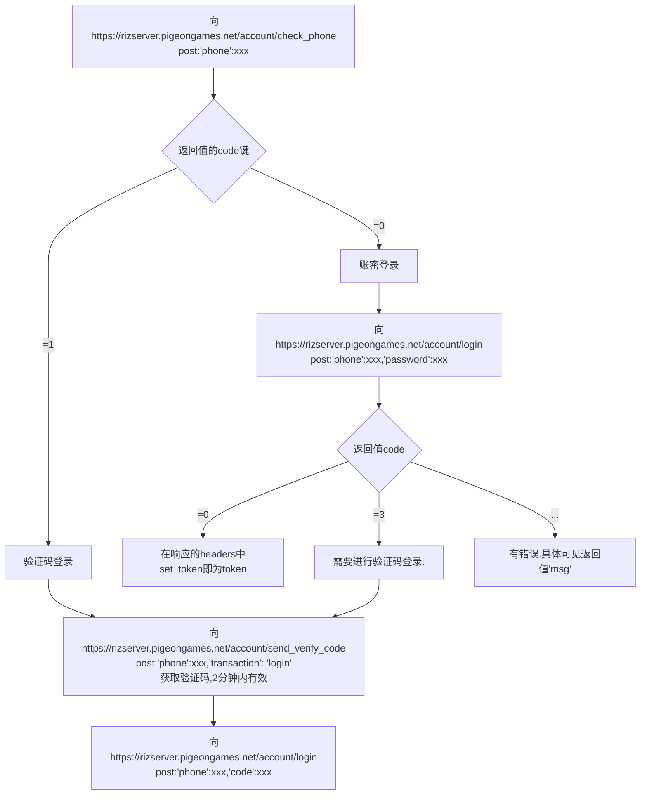

# RizlineSavingTest
一个有关rizline存档的无聊仓库

# 请求头
有关存档等信息的请求头一律为:  
{  
  "User-Agent": "UnityPlayer/2022.3.62f2 (UnityWebRequest/1.0, libcurl/8.10.1-DEV)",  // 可省略  
  "Accept": "*/*",  // 可省略  
  "Accept-Encoding": "deflate, gzip", // 可省略  
  "game_id": "pigeongames.rizline",  
  "device_id": "xxx",  // 可生成一个uuid4字符串
  "channel_id": "xxx",   // 可生成一个1-11的随机数
  "i18n": "zh-CN",  // 可省略  
  "token": "xxx",  // 可省略  
  "phone": "xxx",  
  "Content-Type": "application/json",  // 可省略  
  "X-Unity-Version": "2022.3.62f2",  // 可省略  
}  

# 获取token
rizline共三种登录方式:  
- 验证码登录
- 账密登录
- token验证登录  

token生命周期较短。使用token验证登录不是很稳定(在登录另一个设备可能需要重新获取token)
因此token获取大多采取1,2方式
分为以下情况:
1.对于新设备:
必定需要至少一次无法绕行的验证码登录,之后一定期限(约为半天)内可以无限次使用账密登录
2.对于常规设备(即已经登录过一次的设备):
当一定期限过后需要再次使用验证码登录,大多情况下可以使用账密,此时的验证码可以通过在其他设备登录来绕行,从而减少发送验证码的次数

*验证码不能发送过多次。(实测貌似linux阈值更高一些)

# 获取存档
若你之前的headers省略了token,请务必完善。
游戏里将会在此时依次向(按需删减):
- https://rizserver.pigeongames.net/game/get_broadcasts (目前作用未知
- https://rizserver.pigeongames.net/game/get_user_shop (获取商店内容
- https://rizserver.pigeongames.net/game/rn_login (获取存档
发出get。
响应的结果将会是一串base64加密的文本,解密后可使用AES解密

# 存档解密
key,iv 请在 [gameDataAes2Json.py](https://github.com/CHCAT1320/RizlineGameSaveData/)寻找。

# 琐事
我觉得RizScoreUploader.py应该用于测试单曲rks而非成为yyw的工具与捷径。
